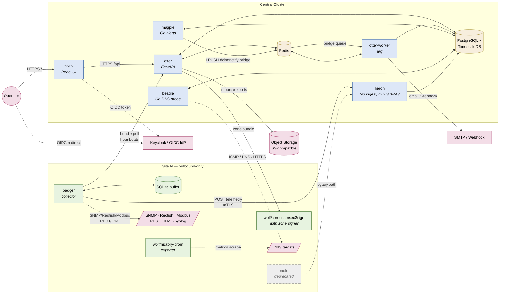

# Architecture

## Goals

1. Operate across **184+ sites** with centralized governance and distributed collection.
2. Tolerate **WAN outages** at any site without losing telemetry.
3. Separate the **inventory plane** (low-volume, transactional) from the **telemetry plane** (high-volume, time-series).
4. Provide **enterprise-wide visibility** while enforcing **per-site/per-enclave authorization**.
5. Scale horizontally on **Kubernetes** in production.

## Component map

Animal names link to package paths. See
[`WORKSPACE.md`](../WORKSPACE.md) for the full naming rationale.

| Animal | Package | Role | Language |
|---|---|---|---|
| **otter** | [packages/otter](../packages/otter) | Central API (FastAPI) | Python |
| **otter-worker** | (same image) | arq async worker — notifications, bulk ops | Python |
| **finch** | [packages/finch](../packages/finch) | React + Vite dashboard | TypeScript |
| **heron** | [packages/heron](../packages/heron) | Telemetry ingest (mTLS, :8443) | Go |
| **magpie** | [packages/magpie](../packages/magpie) | Alert evaluator + collector sweep | Go |
| **beagle** | [packages/beagle](../packages/beagle) | DNS health probe | Go |
| **badger** | [packages/badger](../packages/badger) | Site collector (SNMP/Redfish/Modbus/REST/IPMI) | Go |
| **mole** | [packages/mole](../packages/mole) | Legacy Python collector (deprecated) | Python |
| **wolf** | [packages/wolf](../packages/wolf) | CoreDNS NSEC3 plugin + Hickory Prom exporter | Go |
| **shared-go** | [packages/shared-go](../packages/shared-go) | Shared Go utilities (env helpers) | Go |

## Component diagram

### Connections at a glance

- **UI → API.** `finch` calls `otter` via the ingress (`/api`); the
  OIDC dance lives between `finch` and the IdP.
- **Hot write path.** `badger` (and legacy `mole`) post telemetry
  batches over **mTLS** to `heron:8443`, which writes the
  `telemetry_samples` hypertable + freshness rows on PG concurrently.
- **Cold write path.** `badger` also talks to `otter` for low-volume
  endpoints (bundle polling, heartbeats, config fetch).
- **Alerting.** `magpie` polls `pg`, fires/resolves alerts, LPUSHes
  notify jobs into `redis:dcim:notify:bridge`; `otter-worker` consumes
  that bridge and dispatches email/webhook via SMTP.
- **DNS health.** `beagle` reads `dns_health_checks` from `pg`, probes
  targets, writes back status. The `wolf` family handles authoritative
  zone signing (CoreDNS plugin) and Hickory metrics export.
- **Site → central is outbound-only.** No inbound ports on a site;
  every connection originates from `badger`. WAN outage → SQLite
  buffer drains on reconnect with idempotent batch posts.

## Data planes

### Inventory plane (PostgreSQL — source of truth)

- Region, Site, Building, Room, Row, Rack, Asset (PDU, sensor, UPS, CRAC, switch, server, etc.)
- Cables, circuits, power feeds, RU positions
- Users, roles, permissions, scopes (RBAC + ABAC)
- API tokens, scoped to site/role/integration
- Alert rules (enterprise + site overrides), maintenance windows, suppressions
- Audit log (every enterprise-impacting action)
- Collector registry (id, site, mTLS cert fingerprint, last seen)

Indexes are designed around: `site_id`, `rack_id`, `device_id`, `collector_id`, `timestamp`, alert state, lifecycle state.

### Telemetry plane (TimescaleDB hypertable)

- Single `telemetry_samples` hypertable in the same PostgreSQL database as inventory. Monthly chunks; columnar compression policy kicks in after 7 days; rows drop after 24 months.
- Unique constraint on `(collector_id, batch_id, seq, ts)` makes collector retries idempotent.
- Indexes on `(asset_id, metric, ts DESC)` and `(site_id, metric, ts DESC)` cover the dashboard, forecast, and alert read paths.
- `telemetry_hourly` continuous aggregate refreshes hourly for long-horizon queries (Phase 4 will route rules with `duration_seconds >= 1h` through it directly).
- Each row carries `site_id`, `collector_id`, `asset_id`, `metric`, `value`, `unit`, `ts`, `received_at`, `tags` (JSONB).

### Cache / queue

- Redis backs **arq** queues for: scheduled polling sync, alert evaluation, report generation, bulk imports.
- Redis also caches RBAC scope expansions and dashboard rollups.

## Scopes & authorization

- **Authn:** OIDC (Keycloak/Azure AD) primary; SAML pluggable. Local fallback for break-glass.
- **Authz:** Roles grant capabilities; **scopes** restrict targets.
  - Capabilities: `inventory:read`, `inventory:write`, `power:control`, `alerts:ack`, `audit:read`, etc.
  - Scopes: any combination of `region_id`, `site_id`, `org`, `enclave`, `mission`, plus a set-based `site_group_id`.
- **Power-control** capabilities are separately permissioned and may require dual-approval (configurable per site).
- **API tokens** carry their own scope subset (cannot exceed user's scope).

## Resiliency

- Site collectors are **outbound-only**. They authenticate to the central ingest endpoint via mTLS (preferred) or signed JWT.
- Each collector maintains a **local SQLite buffer**. On WAN outage, polling continues, samples accumulate, and the forwarder drains them on reconnect with idempotent batch posts.
- Central UI surfaces **freshness** per device: `current` / `stale` / `estimated` / `manual`. A collector-down alert fires when `last_seen > threshold` (per-site default).

## Horizontal scaling

| Component        | Scaling model                          |
|------------------|----------------------------------------|
| API              | Stateless, behind ingress; HPA on CPU  |
| Workers          | Stateless arq workers; HPA on queue depth |
| Ingest           | Stateless; sticky-less; mTLS terminated at ingress or app |
| PostgreSQL       | HA (Patroni / cloud-managed); read replicas for reports |
| Redis            | Sentinel or cluster                    |
| Object storage   | S3-compatible for reports/exports/imports |

## Future deliverables

- Helm chart with values for air-gapped/STIG-hardened deployments.
- BGP/anycast for collector ingest in multi-region central deployments.
- Streaming replication of Postgres audit logs to a separate WORM store for FedRAMP/IL controls.
