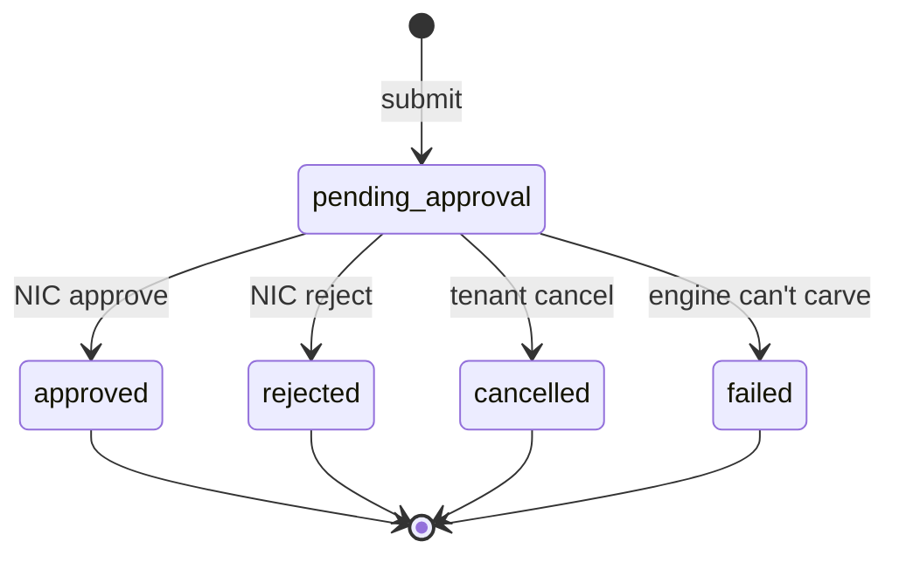
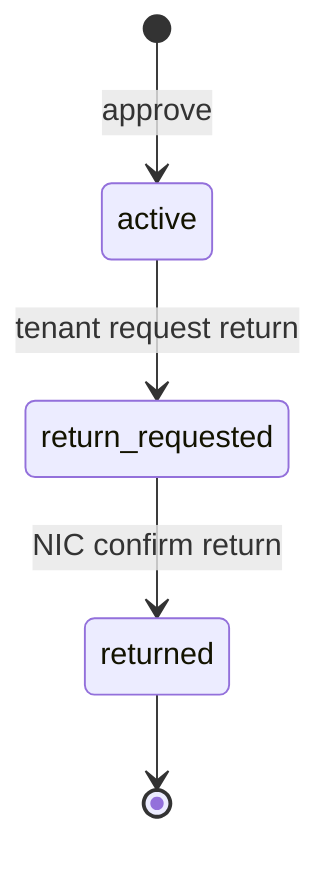
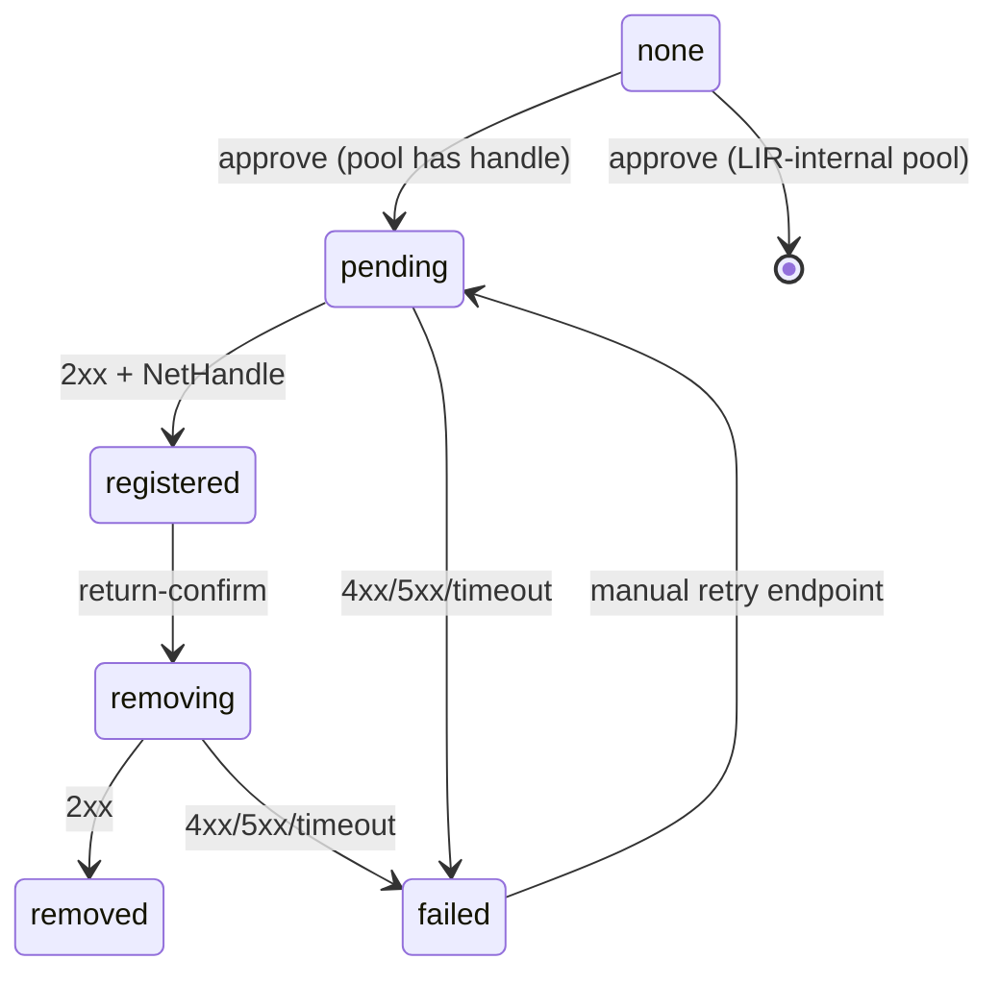

# LIR — Local Internet Registry

DCIM's Local Internet Registry module. A LIR sub-allocates IP space
out of ARIN-registered aggregates and assigns it to internal
organizations. In our setup, DoW NIC is the LIR; tenant organizations
are the customers; ARIN is upstream.

The module covers the full life of an allocation:

  request → approval → carve + landing → move → ARIN feed-up → return

…and exposes both the workflow (tenant + NIC pages) and the SQL
substrate (pools, requests, allocations) the rest of the system can
read.

## Where the code lives

| Concern | Package |
|---|---|
| Schema | Alembic migration `20260528_0065_lir_module.py` in [`packages/otter`](../packages/otter/src/dcim/migrations/versions/) — landing fabric, lir_pools, lir_requests, lir_allocations, `supernets.lir_pool_id` + `supernets.owner_organization_id` |
| Capability catalog + role bundles | [`packages/otter/src/dcim/security/capabilities.py`](../packages/otter/src/dcim/security/capabilities.py) |
| HTTP handlers + business logic | [`packages/otter-go/internal/lir/`](../packages/otter-go/internal/lir/) (Go) |
| ARIN Reg-RWS client + worker | [`packages/otter-go/internal/lir/arin/`](../packages/otter-go/internal/lir/arin/) |
| Worker binary | [`packages/otter-go/cmd/otter-go-worker/`](../packages/otter-go/cmd/otter-go-worker/) |
| IPAM move endpoint (bridge) | [`packages/otter-go/internal/ipam/move.go`](../packages/otter-go/internal/ipam/move.go) |
| Frontend (tenant + NIC) | [`packages/finch/src/pages/lir.tsx`](../packages/finch/src/pages/lir.tsx), [`packages/finch/src/components/lir-*.tsx`](../packages/finch/src/components/) |

Schema is the Python side's sole responsibility. Everything else
(handlers, worker, frontend) is Go + TypeScript.

## Concepts

A **pool** is a named bucket of supernet space the LIR will
sub-allocate from. Pinned to one IP family + a min/max prefix
length + an optional ARIN parent net handle. The pool holds zero or
more **source supernets** (regular IPAM Supernet rows flagged with
`lir_pool_id`) — those are the aggregates the carver chops up.

A **request** is the tenant's ask: family, prefix length, optional
pool preference, optional purpose, required justification. Submitted
via `POST /lir/requests`; reviewed by NIC.

On approve, the engine carves a free sub-prefix out of one of the
pool's source supernets and lands it as a new tenant **Supernet**
in the system **landing fabric** (slug `lir-unassigned`, seeded by
the migration). The link between pool source and tenant supernet is
the **allocation** row — pools and tenant supernets live in
independent IPAM trees joined only here.

The tenant then **moves** the supernet from the landing fabric to
the operational fabric/VRF they want to use it in. Moving is a
separate verb because the right destination is a deployment-specific
decision (`POST /ipam/supernets/{id}/move`).

If the pool has an `arin_parent_net_handle`, the approval also queues
an **ARIN Reg-RWS submission**. The worker drains pending rows and
records ARIN's assigned `arin_net_handle` on success.

A **return** is the reverse: tenant requests, NIC confirms, ARIN
deassignment auto-queues for any registered allocation. The carved
range becomes reusable as soon as confirm runs (the carver excludes
`status='returned'`).

## State machines

### Request



`failed` is the safety valve when approval ran but no free range
could be carved (pool exhausted, every source supernet full). The
NIC can redirect to a different pool and retry — the request is
*not* terminal in this state.

### Allocation lifecycle



### ARIN status

Per-allocation, drives the worker:



The worker tells submit-direction from remove-direction by the
presence of `arin_net_handle` — submit when null, remove when set.

## API surface

All endpoints under `/api/v1`, capability-gated under the `lir`
domain in [`capabilities.py`](../packages/otter/src/dcim/security/capabilities.py).

### Pools (NIC)

| Method + path | Cap |
|---|---|
| `GET /lir/pools` | `lir:pools:read` |
| `POST /lir/pools` | `lir:pools:create` |
| `GET /lir/pools/{id}` | `lir:pools:read` |
| `PATCH /lir/pools/{id}` | `lir:pools:update` |
| `DELETE /lir/pools/{id}` | `lir:pools:delete` |
| `GET /lir/pools/{id}/supernets` | `lir:pools:read` |
| `POST /lir/pools/{id}/supernets` | `lir:pools:update` |
| `DELETE /lir/pools/{id}/supernets/{sid}` | `lir:pools:update` |

### Requests

| Method + path | Cap |
|---|---|
| `POST /lir/requests` | `lir:requests:create` |
| `GET /lir/requests` (org-scope filtered) | `lir:requests:read` |
| `GET /lir/requests/{id}` | `lir:requests:read` |
| `POST /lir/requests/{id}/cancel` | `lir:requests:cancel` |
| `POST /lir/requests/{id}/approve` | `lir:requests:approve` |
| `POST /lir/requests/{id}/reject` | `lir:requests:reject` |

### Allocations

| Method + path | Cap |
|---|---|
| `GET /lir/allocations` (org-scope filtered) | `lir:allocations:read` |
| `GET /lir/allocations/{id}` | `lir:allocations:read` |
| `POST /lir/allocations/{id}/return-request` | `lir:allocations:return-request` |
| `POST /lir/allocations/{id}/return-confirm` | `lir:allocations:return-confirm` |
| `POST /lir/allocations/{id}/arin/retry` | `lir:allocations:arin-retry` |

### IPAM bridge

| Method + path | Cap |
|---|---|
| `POST /ipam/supernets/{id}/move` | `ipam:supernets:update` |

Role bundles:

  * **EnterpriseAdmin** — `*` covers everything.
  * **RegionalAdmin** — `lir:*`.
  * **Viewer / Auditor** — `lir:*:read`.
  * **LirNicOperator** — `lir:*` plus read on inventory:organizations,
    inventory:sites, ipam:fabrics, ipam:supernets, ipam:subnets,
    alerts. Workflow-scoped, narrow elsewhere. The NIC team's
    intended bundle.

## ARIN Reg-RWS feed-up

Approval queues a Reg-RWS reassign-detailed POST against the pool's
`arin_parent_net_handle`. Pools with no handle are LIR-internal —
no upstream call; `arin_status` stays `none`.

### Config

Three `system_settings` rows, settable via the admin Settings panel:

| Key | Value type | Default | Notes |
|---|---|---|---|
| `arin.regrws.endpoint` | string | `https://reg.ote.arin.net` | OT&E test environment. Flip to `https://reg.arin.net` to go live. |
| `arin.regrws.api_key` | string | `""` (disabled) | The Reg-RWS API key. Sent as `?apikey=…`. Rotation = upsert. |
| `arin.regrws.enabled` | bool | `false` | Master switch. Worker is a no-op until set to `true`. |

The worker reads these every tick, so an admin can rotate the key
without restarting `otter-go-worker`.

### Backoff

Per-allocation, max **5 attempts**. Intervals between attempts:

| Attempt | Wait before next |
|---|---|
| 1 fails | 1 minute |
| 2 fails | 5 minutes |
| 3 fails | 30 minutes |
| 4 fails | 2 hours |
| 5 fails | permanent (manual retry only) |

Backoff is encoded twice — once as a SQL `CASE` in
[`lir_arin.sql`](../packages/otter-go/db/queries/lir_arin.sql),
once as `BackoffAfterAttempt` in
[`backoff.go`](../packages/otter-go/internal/lir/arin/backoff.go).
A test pins the two together so a refactor of one without the other
fails CI.

### Manual retry

After 5 failed attempts the row sits permanently in `arin_status =
'failed'`. The NIC hits `POST /lir/allocations/{id}/arin/retry`
(UI button on the LIR allocations tab) to reset `arin_attempts=0`
and flip status back to `'pending'`. The worker picks the row up on
its next tick.

The retry endpoint also accepts `arin_status='none'` rows — useful
when an operator wires a previously-blank pool with an ARIN handle
and wants prior allocations to register.

### Worker process

Separate `cmd/otter-go-worker` binary, deployed as its own k8s
Deployment so its lifecycle is independent of the API:

  * Tick: 30 s by default (`WORKER_TICK_SECONDS`).
  * Per tick: up to `WORKER_MAX_PER_TICK` (default 10) jobs across
    both directions (submit first, then remove).
  * Concurrency: `FOR UPDATE OF lir_allocations SKIP LOCKED` —
    safe to scale replicas > 1; two workers pick disjoint rows.
  * Crash recovery: row locks release with the aborting tx, so
    the next tick re-claims the row automatically.

## Local dev

```sh
# 1. Bring the stack up.
make up
make migrate

# 2. Seed the baseline demo dataset (admin user, sites, racks).
make seed-local

# 3. Seed the LIR sample.
make seed-lir-local
```

The LIR seed plants:

  * Two organizations (`DoW NIC` operator + `Example Tenant`).
  * One operational fabric `dow-nipr` + its default VRF.
  * One pool source supernet `10.99.0.0/16` (RFC1918 — dev only).
  * One pool `dow-v4-nipr` (IPv4, `/20`–`/29`, no ARIN handle).
  * One pending request from the admin user for an IPv4 `/28`.

Sign in at `http://localhost:5173`, navigate to `/lir`. The
**Approval queue** surfaces the pending request; clicking **Approve**
runs the engine, carves a `/28` out of `10.99.0.0/16`, and the new
allocation appears in **My allocations**. Open `/ipam` → **Unassigned
(LIR)** to **Move** it from the landing fabric to wherever you want
to use it.

The seed is idempotent — re-run after the operator has approved or
moved things; the script leaves existing rows alone and won't ship a
second pending sample.

## Operator workflows

### "How do I let a tenant request space?"

  1. Grant the tenant's principal `lir:requests:create` and
     `lir:requests:read` scoped to the right `organization_id`
     (typically via OIDC role mapping).
  2. Confirm there's at least one **enabled** pool matching the
     tenant's required family with at least one source supernet
     attached. The Approval queue won't have anything to carve from
     otherwise.

### "How do I rotate the ARIN API key?"

  1. Admin Settings → ARIN.
  2. Paste the new key. (Existing requests in `arin_status=pending`
     pick the new key up on the next worker tick.)
  3. If any rows are sitting in `arin_status=failed` from the old
     key, hit Retry on each from the LIR allocations tab.

### "An allocation got stuck in arin_status=failed."

  1. Read `arin_last_error` in the allocation detail row.
  2. Fix the upstream cause (bad parent handle, throttling, etc.).
  3. Click **Retry ARIN** in the UI, or
     `POST /lir/allocations/{id}/arin/retry`.

### "A tenant wants their space back."

  1. Tenant clicks **Request return** in `/lir` → My allocations.
     They provide a reason.
  2. NIC sees the row flip to `return_requested`; clicks
     **Confirm return**.
  3. If `arin_status='registered'`, the SQL flips it to `removing`
     and the worker calls Reg-RWS DELETE on the next tick.
  4. The carved range is immediately reclaimable for new
     allocations — the carver excludes `status='returned'`.

## Schema reference

Migration `20260528_0065_lir_module.py` is the source of truth.
Highlights:

  * `lir_pools` — pool definition. `CHECK` ensures `min_prefix_length
    ≤ max_prefix_length` and both fit the family's address width.
  * `lir_requests` — state machine via `status` VARCHAR + CHECK
    enum. `ck_lir_request_decision_consistency` ensures
    `decided_at` + `decided_by_user_id` are set on
    approved/rejected/failed rows.
  * `lir_allocations` — 1:1 with an approved request via
    `UNIQUE(request_id)`. Tenant supernet linkage via
    `UNIQUE(tenant_supernet_id)`. ARIN columns drive the worker.
  * `supernets.lir_pool_id` + `supernets.owner_organization_id` —
    mutually exclusive via
    `CHECK ck_supernet_lir_xor_owner` so a single row can't be both
    a pool source and a tenant allocation.
  * `fabrics.is_system` — protects the landing fabric and any other
    platform-managed fabric from accidental UI delete.
  * Seed row: fabric `(slug='lir-unassigned', is_system=true)` + its
    default VRF, inserted in the same migration.

The Go side reads via sqlc; query files in
[`packages/otter-go/db/queries/`](../packages/otter-go/db/queries/)
(`lir.sql`, `lir_requests.sql`, `lir_allocations.sql`, `lir_arin.sql`,
`lir_returns.sql`, `ipam_move.sql`).
